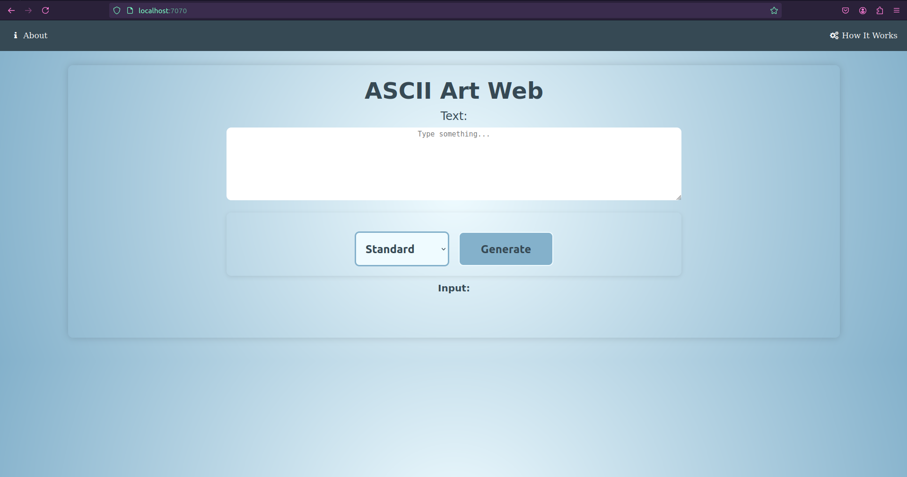
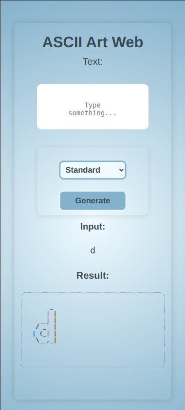
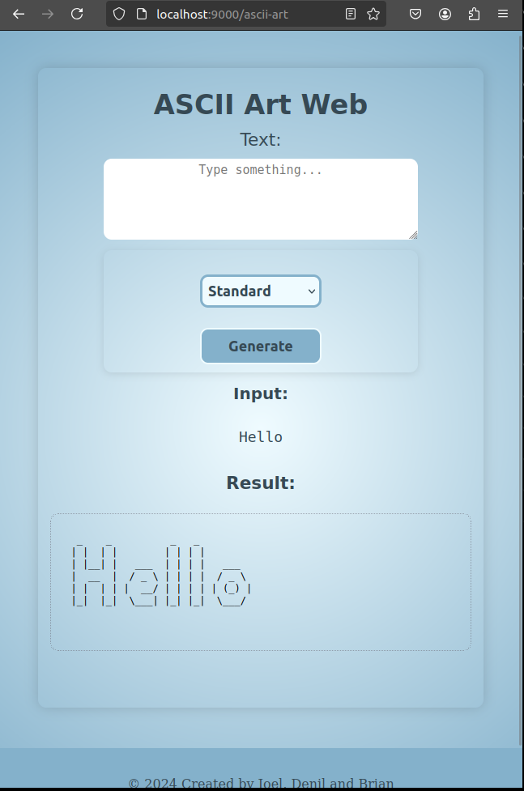

# ascii-art-web-dockerize

## Description

This project ascii-art-web-stylize aims at creating and running a server, displaying an equivalent ASCII art representation of an input on a web graphical user interface(GUI) incorporating templates embedded on HTML webpages, styling properties using stylesheets written in CSS and improving the interactivity of the web application. 

The main aim of this project is to make the website more appealing, user-friendly, interactive and intuitive; achieved through consistency, responsiveness and interactivity features embedded on the HTML webpages. This is realised by linking HTML web pages to stylesheets written in CSS.

This program is written in Go, HTML(Hypertext Markup Language), and styled using Cascading Style Sheet(CSS).

## Authors
This program is authored by [Denil Anyonyi](https://learn.zone01kisumu.ke/git/danyonyi), [Brian Shisia](https://learn.zone01kisumu.ke/git/bshisia) and [Joel Amos](https://learn.zone01kisumu.ke/git/jamos)


## Usage: how to run

* Set up Go language on your machine depending on your system's operating system by following the steps in the official [Go page](https://go.dev/doc/install).

* After setting up your machine, clone the repository from [Gitea](https://learn.zone01kisumu.ke/git/jamos/ascii-art-web-stylize).
```bash
git clone https://learn.zone01kisumu.ke/git/jamos/ascii-art-web-stylize
```

* In the project's root directory, open the terminal and run the program as follows:

```bash
    go run main.go [PORT]
```

* After running the above command in the terminal, a webpage will be opened on your browser; hosted on the localhost with a specified port number, e.g. *port: 9000*.

* Switch to your browser and type in the search bar and the ASCII-art index page will be displayed. 

```bash
  Server started at http://localhost:9000
```


* Type into the input box, a text you would like to be displayed, select a banner file from the choices of banner files provided, or otherwise use the default banner file and press __Generate__ to view the equivalent ASCII-Art representation of your input.

* On execution, the output will be displayed as below:



* The example displayed below gives a visual representation of the ASCII-Art web application when viewed on devices with smaller screen size.



* The example displayed below gives a visual representation of the ASCII-Art web application when an input is parsed and generated using 



## Implementation


This program utilizes various Go Standard packages in its implementation. The core packages used are: 
1. *net* package that provides a portable interface for I/O, including TCP/IP(Transmission Control Protocal/Internet Protocal), UDP(User Datagram Protocal), domain name resolution and Unix domain sockets.

Below is an implementation of _http_ package under the *net* package showing the process of making HTTP _POST_ requests:

```go
   if strings.ToUpper(r.Method) != http.MethodPost {
		ServeError(w, "Method Not Allowed", http.StatusMethodNotAllowed)
		return
	}

	text := r.FormValue("text")

	banner := r.FormValue("banner")
```
2. *path* package that implements utility routing for manipulating slash-separated paths(routes).
Below is an implementation of the *path* package in defining routes using _filepath_.

```go
    if r.URL.Path != "/ascii-art" || r.URL.Path != "/" {
		ServeError(w, "page not found", http.StatusNotFound)
		return
	}
	tmpl, err := template.ParseFiles("templates/index.html")
	if err != nil {
		fmt.Fprintf(w, "error: %s", err)
		return
	}
```
3. *text* package that is used to implement data-driven templates for generaing textual output.
```go
    tmpl, err := template.ParseFiles("templates/error.html")
	if err != nil {
		log.Printf("error parsing files: %v\n", err)
		http.Error(w, "Internal server error", http.StatusInternalServerError)
		return
	}

	code := strconv.Itoa(statusCode)

	var data = Message{
		Code:       code,
		ErrMessage: errVal,
	}
```
The equivalent template implementation in HTML is defined:
```html
    <div class="wrapper">
        <div class="container">
            <pre class="status-code">{{ .Code }}</pre>
            <pre class="status-msg">{{ .ErrMessage }}</pre>
            <button><a href="/">Homepage</a></button>
        </div>
    </div>
```

* This project styling is done by use of a CSS stylesheet. Below is a representation of responsiveness in devices with displays of a _max-width: 700px_.

```css

	@media (max-width: 700px) {
		.container h1 {
			font-size: 1.4em;
		}
	}	
```


## Contributions

- All contributions are welcome! If you find any issues within the working of the program, or have any suggestions for improvements, please open an issue or submit a pull request.

### Steps on how to open a PR:
    - Fork the repository
    - Create your feature branch (git checkout -b feature-name)
    - Commit your changes (git commit -am 'Add feature')
    - Push to the branch (git push origin feature-name)
    - Open a pull request

## License

This project is licensed under the MIT - see the [LICENSE](https://learn.zone01kisumu.ke/git/jamos/ascii-art-web-stylize/src/branch/master/LICENSE) for details.